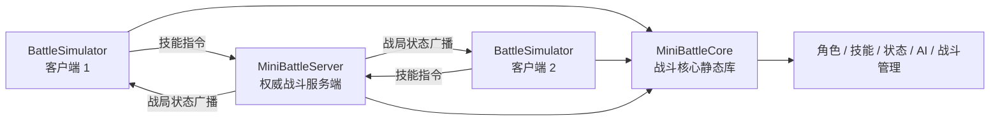

# Mini Battle Simulator

基于 C++20 开发的 Windows 控制台回合制战斗模拟器，支持本地 PVE 与双人联网 PVP。项目将战斗规则抽离为 Core 静态库，由客户端复用本地逻辑、服务端负责联网战局判定，以实践面向对象设计、资源管理、多线程同步和 TCP 网络编程。

## 核心功能

- 本地 PVE：玩家与 AI 敌人进行回合制战斗，支持中途退出
- 联网 PVP：两名客户端自动匹配，由服务端初始化并维护权威战局
- 五种技能：伤害、单次治疗、持续治疗与防御提升，包含冷却机制
- 状态效果：按回合执行持续效果，并自动清理过期状态
- 敌人 AI：根据技能收益评分自动选择行动
- 战斗表现：同步展示角色属性、当前回合、技能冷却与行动结果
- 异常处理：校验无效技能、非当前回合操作，并处理客户端断开连接

## 技术栈

`C++20` · `Visual Studio 2022` · `STL` · `Winsock2` · `std::thread` · `mutex` · `atomic`

## 项目架构



| 模块 | 主要职责 |
| --- | --- |
| `MiniBattleCore` | 管理角色、技能、状态效果、AI、回合规则与战局数据 |
| `BattleSimulator` | 菜单状态机、本地 PVE、网络输入、状态解析与控制台渲染 |
| `MiniBattleServer` | 客户端匹配、PVP 初始化、指令校验、权威结算和状态广播 |
| `MiniBattleClient` | 独立的 Winsock 通信测试客户端 |

## 工作流程

### 本地 PVE

输入 `b` 后，客户端通过 Core 创建玩家和敌人；`BattleManager` 推进回合，玩家选择技能，敌人 AI 根据收益评分行动，直至战斗结束或玩家输入 `z` 返回菜单。

```text
Game → BattleManager → CharacterManager → Player / Enemy → Skill / EffectStatus
```

### 联网 PVP

1. 两个客户端输入 `n` 并连接服务端 `8888` 端口。
2. 服务端将连接加入匹配队列，人数满足后创建 PVP `BattleManager`。
3. 客户端只发送技能编号；服务端校验玩家身份、行动顺序和技能冷却。
4. 服务端完成技能结算，将角色属性、回合、冷却和行动信息广播给双方。
5. 客户端解析服务端数据并刷新界面；一方断开时，服务端终止战局并通知另一方。

## 设计亮点

- 通过 `Character`、`Skill` 等抽象接口实现运行时多态，降低角色与技能扩展成本。
- 使用 `unique_ptr`、移动语义和 RAII 管理角色、技能及战局生命周期。
- 使用 `std::function` 与技能工厂集中维护伤害、治疗和增益计算规则。
- Core 静态库同时供客户端和服务端复用，避免两端重复实现战斗规则。
- PVP 采用服务端权威模型，客户端只提交操作，服务端负责校验与状态推进。
- 服务端使用独立通信线程、消息队列、互斥锁和原子状态协调双客户端战斗。
- 客户端对比前后状态，以颜色高亮生命值、伤害、治疗和防御变化。

## 构建与运行

环境要求：Windows 10/11、Visual Studio 2022、MSVC v143。

```powershell
msbuild .\MiniBattleSimulator.sln /p:Configuration=Debug /p:Platform=x64
```

- 本地模式：启动 `BattleSimulator`，输入 `b`。
- 联网模式：先启动 `MiniBattleServer`，再启动两个 `BattleSimulator`，分别输入 `n`。
- 技能选择：输入 `1`～`5`；主菜单输入 `q` 退出。

## 简历描述参考

> 使用 C++20 开发支持 PVE/PVP 的控制台回合制战斗模拟器，将角色、技能、状态效果及战斗规则抽离为 Core 静态库；基于继承、多态、智能指针和函数对象实现可扩展技能体系与收益评分 AI；使用 Winsock2、多线程、消息队列、互斥锁和原子变量实现双客户端匹配及状态同步，并采用服务端权威模型完成回合校验、技能结算和战局广播。
