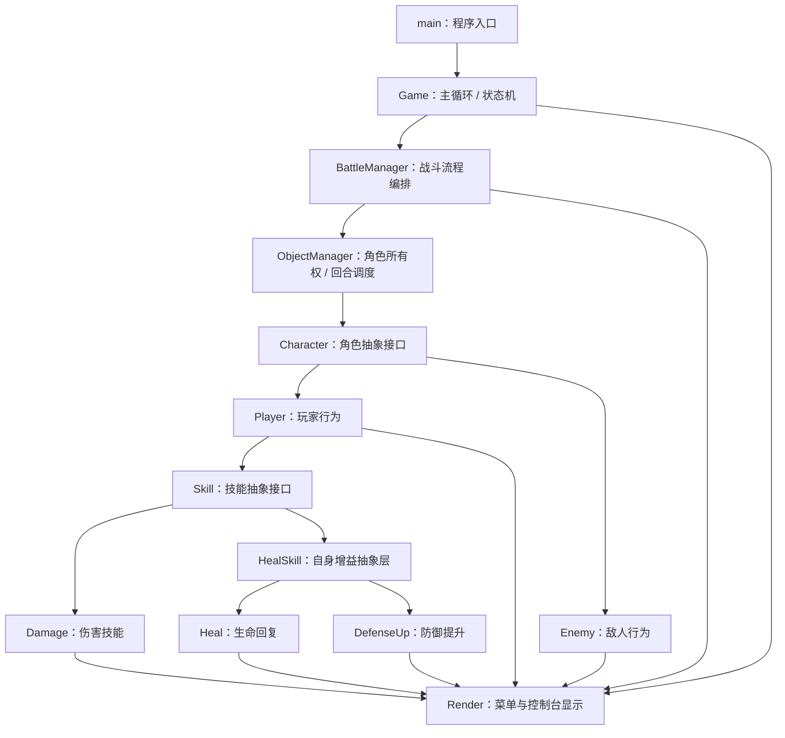
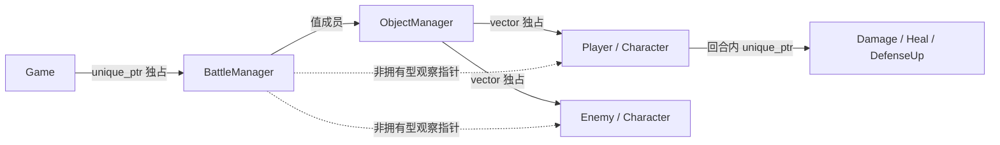
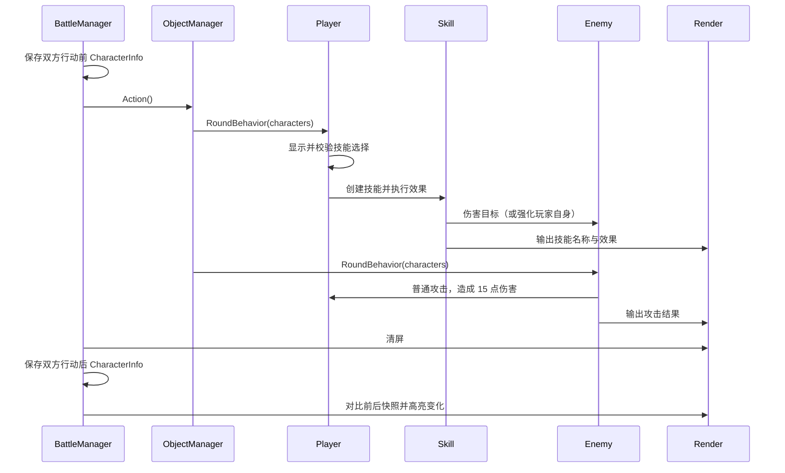

# Mini Battle Simulator

一个基于现代 C++ 与面向对象设计实现的 Windows 控制台回合制战斗模拟器。项目以“小型但完整的战斗闭环”为目标，将游戏状态、战斗编排、对象生命周期、角色行为、技能效果与终端渲染拆分到不同模块中，用于实践继承、多态、封装、RAII、智能指针、函数对象和状态机等技术。

## 项目概览

玩家可以从主菜单进入战斗，在每个回合中选择伤害、治疗或增益技能；敌人随后执行普通攻击。系统会比较行动前后的角色快照，用不同颜色展示生命值、攻击力和防御力的变化，并在任一角色死亡后结算胜负、返回菜单。

### 核心功能

- 菜单与战斗两种游戏状态的切换
- 玩家/敌人回合行为的多态调度
- 火球术、冰封剑、生命回复、防御提升四种技能
- 使用 Lambda 表达式注入不同伤害公式
- 角色对象的统一管理与自动内存回收
- 战斗属性变化的彩色控制台反馈
- 单局战斗结束后回到菜单，可重复开始新战斗

## 技术栈与实践要点

| 类别 | 内容 |
| --- | --- |
| 开发语言 | C++14 及以上 |
| 开发环境 | Visual Studio 2022、MSVC v143 |
| 运行平台 | Windows 控制台（Win32 / x64） |
| 面向对象 | 抽象基类、继承、运行时多态、封装 |
| 资源管理 | `std::unique_ptr`、移动语义、RAII |
| 行为注入 | `std::function`、Lambda 表达式 |
| 数据组织 | `std::vector`、角色状态快照 `CharacterInfo` |
| 架构思路 | 状态机、分层职责、组合优于全局对象 |

## 项目架构

```text
MiniBattleSimulator/
├── MiniBattleSimulator.sln
├── readme.md
└── BattleSimulator/
    ├── main.cpp                  # 程序入口
    ├── Game.h / game.cpp         # 游戏主循环与状态切换
    ├── BattleManager.*           # 单局战斗的初始化、循环与结算
    ├── ObjectManager.*           # 角色集合、所有权与回合调度
    ├── Character.*               # 角色抽象基类与公共属性
    ├── Player.*                  # 玩家输入与技能选择
    ├── Enemy.*                   # 敌人回合行为
    ├── Skill.*                   # 技能抽象接口
    ├── Damage.*                  # 可配置伤害技能
    ├── HealSkill.*               # 治疗/增益技能体系
    └── Render.*                  # 清屏、延时、颜色与状态输出
```

### 分层关系



架构的核心是“流程编排”和“具体行为”分离：上层只决定何时开始、推进和结束战斗，下层角色通过统一接口自行完成每回合行为。添加新角色时，可以通过覆写 `RoundBehavior()` 接入现有回合调度；添加新的伤害技能时，可以复用 `Damage`，仅注入新的伤害计算 Lambda。

## 类职责与依赖关系

| 类 / 结构 | 负责管理的内容 | 主要依赖 | 被谁使用 |
| --- | --- | --- | --- |
| `Game` | 程序生命周期、主菜单、输入处理、`Menu/Battle` 状态切换，以及 `BattleManager` 的创建和销毁 | `BattleManager`、`Render`、`std::unique_ptr` | `main` |
| `BattleManager` | 创建一局中的玩家与敌人、保存便捷观察指针、推进战斗循环、记录行动前后快照并判断胜负 | `ObjectManager`、`Player`、`Enemy`、`Render` | `Game` |
| `ObjectManager` | 以 `vector<unique_ptr<Character>>` 独占所有角色对象，统一添加角色并依次触发回合行为 | `Character`、STL 容器与智能指针 | `BattleManager` |
| `CharacterInfo` | 作为角色状态的数据传输对象，提供名称、生命、攻击和防御的值类型快照 | `std::string` | `Character`、`BattleManager`、`Render`、技能伤害公式 |
| `Character` | 封装角色公共属性和生命状态，提供受伤、属性修改、状态快照以及纯虚回合接口 | STL | `Player`、`Enemy`、`ObjectManager`、技能体系 |
| `Player` | 展示技能列表、校验玩家输入、创建并释放本回合技能、选择目标和执行效果 | `Character`、`Damage`、`Heal`、`DefenseUp`、`Render` | `BattleManager` |
| `Enemy` | 实现敌人的回合策略；当前版本固定对玩家造成 15 点普通攻击伤害 | `Character`、`Render` | `BattleManager` |
| `Skill` | 定义技能名称、使用接口 `Use()` 和技能信息输出接口 `CoutSkill()` | `Character` | `Damage`、`HealSkill` |
| `Damage` | 接收并保存伤害计算函数，在施法时计算数值、扣减目标生命并输出技能结果 | `Skill`、`std::function`、`Render` | `Player` |
| `HealSkill` | 表示作用于施法者自身的增益技能，新增抽象接口 `Effect()` | `Skill` | `Heal`、`DefenseUp` |
| `Heal` | 为施法者恢复 20 点生命；通过 `SetHP()` 将生命上限限制为 100 | `HealSkill`、`Render` | `Player` |
| `DefenseUp` | 为施法者永久增加 10 点防御并显示属性变化 | `HealSkill`、`Render` | `Player` |
| `Render` | 封装 Windows 控制台颜色、清屏、延时、角色状态输出和属性变化高亮 | Win32 API、`CharacterInfo` | 游戏、战斗、角色和技能模块 |

### 继承体系

```text
Character（抽象角色）
├── Player
└── Enemy

Skill（抽象技能）
├── Damage
└── HealSkill（抽象增益技能）
    ├── Heal
    └── DefenseUp
```

### 对象所有权



- `Game` 独占当前战斗管理器；退出单局战斗时调用 `reset()`，战斗相关资源随之释放。
- `ObjectManager` 是角色对象的真正所有者，依靠 `unique_ptr` 避免手动 `delete` 和重复释放。
- `BattleManager` 中的 `Player*` 与 `Enemy*` 只是非拥有型观察指针，便于判断战斗是否结束；对象实际生命周期仍由 `ObjectManager` 控制。
- 技能对象仅在玩家当前回合内存在，技能执行结束后自动销毁，体现 RAII 的局部资源管理方式。

## 完整工作流程

### 1. 程序启动与菜单循环

1. `main()` 在栈上创建 `Game` 对象并调用 `Game::Run()`。
2. `Game` 构造函数将 `isRunning` 设为 `true`，初始状态设为 `GameState::Menu`。
3. `Run()` 输出欢迎语和菜单，然后持续接收命令：

   - 输入 `b`：将状态切换为 `Battle`。
   - 输入 `q`：结束主循环并退出程序。

4. 当状态进入 `Battle` 时，`Game` 创建新的 `BattleManager`，保证每局战斗使用全新的角色数据。

### 2. 战斗初始化

1. `Game::EnterBattle()` 调用 `BattleManager::InitializeBattle()`。
2. `BattleManager` 分别通过 `make_unique` 创建 `Player` 和 `Enemy`，初始生命均为 100。
3. 在转移所有权前，管理器保存两个对象的原始指针作为非拥有型观察引用。
4. 两个 `unique_ptr` 被移动到 `ObjectManager` 的角色容器中，之后统一由对象管理器负责生命周期。
5. `ObjectManager::CoutInfo()` 输出双方初始状态。

### 3. 单回合执行



`ObjectManager::Action()` 遍历角色容器，并通过 `Character*` 调用虚函数 `RoundBehavior()`。因此对象管理器不需要判断当前对象是玩家还是敌人，运行时会自动分派到 `Player::RoundBehavior()` 或 `Enemy::RoundBehavior()`。

玩家技能选择如下：

| 输入 | 技能 | 当前效果 |
| --- | --- | --- |
| `1` | 火球术 | `攻击力 × 1.5 - 目标防御力 × 0.3` |
| `2` | 冰封剑 | `攻击力 × 1.2` |
| `3` | 血量回复 | 恢复 20 点生命，最高为 100 |
| `4` | 防御增加 | 永久增加 10 点防御 |

### 4. 状态展示

1. `BattleManager` 在行动前后分别调用 `GetInfo()` 取得值类型快照。
2. `Render::CoutCharacter()` 比较两份快照：生命减少显示红色、生命恢复显示绿色，属性提升使用对应高亮色。
3. 技能模块只负责描述“发生了什么”，颜色设置和控制台恢复统一由 `Render` 处理。

### 5. 胜负结算与资源释放

1. 每轮开始前，`BattleManager` 通过观察指针调用 `IsDead()`；任意一方生命值小于等于 0 时退出战斗循环。
2. 系统输出玩家失败或玩家胜利，并等待输入 `z` 返回菜单。
3. `Game::EnterBattle()` 调用 `battleManager.reset()`：`BattleManager`、`ObjectManager`、角色容器和全部角色按所有权链自动析构。
4. 游戏状态恢复为 `Menu`，用户可以开始下一局或退出程序。

> 当前回合调度采用固定容器顺序：玩家位于索引 `0`，敌人位于索引 `1`，因此每轮为“玩家行动 → 敌人行动”。这是当前双角色原型的约定，也是未来扩展多单位、速度排序或阵营系统时需要优先抽象的位置。

## 设计亮点

### 1. 使用运行时多态消除角色类型判断

`ObjectManager` 面向 `Character` 抽象接口工作，通过虚函数统一调度不同角色行为。新增角色类型只需继承 `Character` 并实现 `RoundBehavior()`，无需修改回合管理器的主流程。

### 2. 使用智能指针表达所有权

角色由 `ObjectManager` 独占，战斗由 `Game` 独占。对象所有权在类型层面清晰可见，避免裸指针负责释放资源；裸指针只承担观察职责。

### 3. 使用函数对象解耦技能流程与伤害公式

`Damage` 封装了“计算伤害 → 修改目标 → 输出结果”的通用流程，而具体公式由 `std::function<int(Character&, Character&)>` 注入。火球术和冰封剑无需分别创建子类，也可以拥有不同计算规则。

### 4. 使用状态快照解耦战斗逻辑与表现层

`CharacterInfo` 将角色内部数据转换为轻量值对象。渲染模块比较行动前后的快照来决定显示颜色，不需要参与技能结算，也不会直接修改角色状态。

### 5. 使用状态机控制顶层流程

`GameState` 明确区分菜单和战斗状态，`Game` 只负责顶层切换，具体战斗细节交由 `BattleManager`，降低主循环与业务逻辑的耦合。

## 构建与运行

### 环境要求

- Windows 10/11
- Visual Studio 2022
- “使用 C++ 的桌面开发”工作负载
- MSVC v143 工具集与 Windows 10 SDK

### Visual Studio 运行

1. 使用 Visual Studio 打开根目录的 `MiniBattleSimulator.sln`。
2. 选择 `Debug` 或 `Release`，平台选择 `x64` 或 `Win32`。
3. 将 `BattleSimulator` 设为启动项目。
4. 按 `Ctrl + F5` 构建并运行。

### 命令行构建（Developer PowerShell）

```powershell
msbuild .\MiniBattleSimulator.sln /p:Configuration=Release /p:Platform=x64
.\x64\Release\BattleSimulator.exe
```

## 操作说明

| 场景 | 指令 |
| --- | --- |
| 主菜单开始游戏 | `b` |
| 主菜单退出程序 | `q` |
| 战斗中选择技能 | `1` ~ `4` |
| 战斗结算后返回菜单 | `z` |

## 可扩展方向

- 将固定下标目标选择升级为阵营与目标选择系统
- 在每个角色行动后立即判断死亡，避免已死亡单位继续执行本轮行为
- 为技能增加消耗、冷却、暴击、状态效果和持续回合
- 将技能配置从代码中抽离到 JSON 等外部数据文件
- 引入速度属性与行动队列，支持多角色战斗
- 抽象渲染接口，降低业务层对 Windows 控制台 API 的依赖
- 增加战斗逻辑单元测试，并为随机行为注入可控随机源

## 简历描述参考

> 使用现代 C++ 开发控制台回合制战斗模拟器，基于状态机拆分菜单与战斗流程，通过 `Character` / `Skill` 抽象基类实现角色和技能的运行时多态；使用 `unique_ptr` 与 RAII 管理战斗对象生命周期，并结合 `std::function` 和 Lambda 实现可注入的伤害计算策略；利用角色状态快照与独立渲染模块展示属性变化，形成可扩展的“游戏流程—战斗编排—对象管理—角色/技能—终端渲染”分层架构。

## 项目定位

本项目是面向对象与现代 C++ 基础能力的实践型作品，目前聚焦于清晰的职责拆分、生命周期管理和可扩展战斗闭环。它适合作为后续加入数据驱动技能、多单位回合系统、AI 策略与自动化测试的基础架构。
